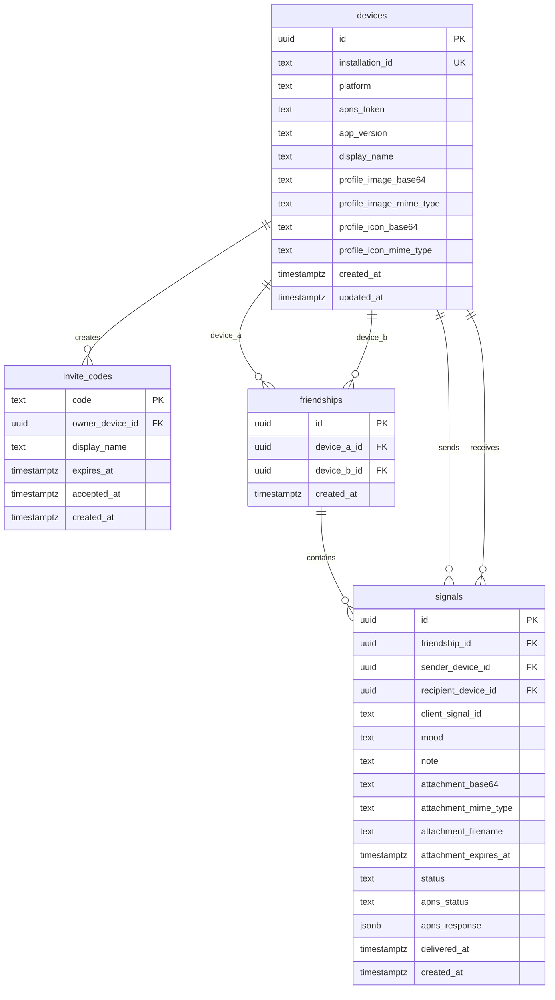

# pui-core bot/test MVP API

missyou の送信MVP用に、`bot/test` 配下だけでPostgresとAPIサーバを起動する構成です。
Firebaseや外部DBは使わず、pui-core内のDocker Composeで完結します。

## 構成

```text
bot/test/
  docker-compose.yml      # Postgres + API
  db/init/001_schema.sql  # 初期スキーマ
  public/                 # 外部公開するAPIサーバ
  secrets/                # APNs秘密鍵置き場。git管理外
```

## DB ER図

初期スキーマは `db/init/001_schema.sql` で定義しています。



- `devices.installation_id` は端末内の永続IDで、API上のユーザーIDとして扱います。
- `invite_codes.owner_device_id`、`friendships.device_a_id/device_b_id`、`signals.*_device_id` は `devices.id` へ外部キー参照します。
- `friendships` は `device_a_id <> device_b_id` と `UNIQUE(device_a_id, device_b_id)` を持ち、API側で2端末のUUIDを正規化して保存します。
- `signals.client_signal_id` は送信者単位で一意です。APNs再送や通信リトライ時に同じスタンプを二重保存しないために使います。
- 今何してる？写真は `signals.attachment_base64` に保存し、`attachment_expires_at` で12時間後に期限切れとして扱います。期限切れまたは初回detail取得後に本文を削除します。

## 初回起動

```bash
cd bot/test
cp .env.example .env
docker compose up
```

APIは既定で `http://localhost:8080` に立ちます。

```bash
curl http://localhost:8080/health
```

`.env` に `PUI_CORE_API_KEY` を設定した場合、API呼び出しには `X-API-Key` が必要です。
現在のmissyou iOS MVPは既定でAPIキーを埋め込まないため、実機で使うテスト環境では `PUI_CORE_API_KEY` を空にしてください。

## API

### `POST /v1/devices/register`

iOS端末のAPNs tokenを登録します。

```json
{
  "installationId": "device-local-install-id",
  "platform": "ios",
  "apnsToken": "apns-device-token",
  "appVersion": "0.1.0",
  "profileDisplayName": "Tsuka",
  "profileImageBase64": "small-jpeg-base64",
  "profileImageMimeType": "image/jpeg",
  "profileIconBase64": "friend-list-jpeg-base64",
  "profileIconMimeType": "image/jpeg"
}
```

### `POST /v1/devices/profile`

登録済み端末の通知表示用プロフィールを更新します。`profileImageBase64` はAPNs payload向けの小さい画像だけを受けます。

```json
{
  "installationId": "device-local-install-id",
  "profileDisplayName": "Tsuka",
  "profileImageBase64": "small-jpeg-base64",
  "profileImageMimeType": "image/jpeg",
  "profileIconBase64": "friend-list-jpeg-base64",
  "profileIconMimeType": "image/jpeg"
}
```

### `POST /v1/invites/create`

フレンド招待コードを作成します。

```json
{
  "ownerDeviceId": "device-uuid",
  "displayName": "Tsuka",
  "profileDisplayName": "Tsuka",
  "profileImageBase64": "small-jpeg-base64",
  "profileImageMimeType": "image/jpeg",
  "profileIconBase64": "friend-list-jpeg-base64",
  "profileIconMimeType": "image/jpeg",
  "expiresInHours": 72
}
```

### `POST /v1/invites/accept`

招待コードを受け取り、2端末間のfriendshipを作成します。

```json
{
  "code": "ABCDE12345",
  "acceptorDeviceId": "device-uuid",
  "profileDisplayName": "Pui",
  "profileImageBase64": "small-jpeg-base64",
  "profileImageMimeType": "image/jpeg",
  "profileIconBase64": "friend-list-jpeg-base64",
  "profileIconMimeType": "image/jpeg"
}
```

### `GET /v1/friends?installationId=...`

指定端末に紐づくfriendshipを双方向で取得します。片方が招待承認してfriendshipが作成されると、もう片方もこのAPIを呼ぶだけで相手を友達一覧へ同期できます。

```json
{
  "friends": [
    {
      "friendship": {
        "id": "friendship-uuid",
        "deviceAId": "device-a-uuid",
        "deviceBId": "device-b-uuid",
        "createdAt": "2026-06-28T00:00:00.000Z"
      },
      "peer": {
        "installationId": "friend-installation-id",
        "displayName": "Mika",
        "profileIconBase64": "friend-list-jpeg-base64",
        "profileIconMimeType": "image/jpeg"
      }
    }
  ]
}
```

### `POST /v1/signals/send`

スタンプをDBに保存し、APNs設定が揃っていれば相手端末へpushします。

```json
{
  "friendshipId": "friendship-uuid",
  "senderDeviceId": "device-uuid",
  "clientSignalId": "ios-generated-id",
  "mood": "littleLonely",
  "note": "少しだけ声が聞きたい"
}
```

### `POST /v1/signals/send-direct`

MVP向けに、端末内で交換した相手のユーザーIDへ直接スタンプを送ります。
送信者・受信者の `installationId` が登録済みなら、サーバ側でfriendshipを自動作成または再利用します。

```json
{
  "senderInstallationId": "sender-device-uuid",
  "recipientInstallationId": "recipient-device-uuid",
  "clientSignalId": "ios-generated-id",
  "mood": "whatsUp",
  "thumbnailName": "stamp-whats-up",
  "attachmentBase64": "full-whats-up-jpeg-base64",
  "attachmentPreviewBase64": "small-notification-preview-base64",
  "attachmentPreviewMimeType": "image/jpeg"
}
```

APNs payloadには `mutable-content: 1`、`thumbnailName`、`senderDisplayName`、`senderProfileImageBase64` を含めます。
iOSアプリ側のNotification Service Extensionが送信者名を通知タイトルにし、送信者プロフィール画像を丸型サムネイルとして表示します。プロフィール画像が無い場合は従来どおり写真または同梱スタンプ画像にフォールバックします。
`mood` が `whatsUp` かつ写真添付が無い場合は、payloadに `signalIntent: "photo_request"` と
`senderInstallationId` を含めます。受信側iOSは通知タップ時にカメラを起動し、撮影画像を同じ
`send-direct` で `mood: "whatsUp"` と写真添付付きの `photo_response` として送り返します。
`photo_response` はDBに `attachmentBase64` のフル画像を保存し、通知payloadには `attachmentPreviewBase64` の軽量プレビューだけを含めます。
`inbox` は写真本文を返さず、未開封表示用の `attachmentExpiresAt` だけ返します。
DBに保存した写真本体は `attachmentExpiresAt` で12時間後に期限切れになり、期限切れ後のdetail取得は `410` を返します。
期限内に `detail` で写真本文を取得した場合、そのレスポンス後に写真本文をDBから削除するため、同じ写真は1回だけ開けます。

対応moodは `whatsUp`, `wantToMeet`, `littleLonely`, `wantToHear`, `thinkingOfYou`, `needHug`, `goodNight`, `cheer`, `missYou`, `sorry`, `letsTalk`, `thanks` です。

### `GET /v1/signals/detail?signalId=...&installationId=...`

通知payloadに含まれる `signalId` から、DBに保存したフルサイズの今何してる？写真と送信者プロフィールを取得します。`installationId` は送信者または受信者本人であることの確認に使います。
写真本体の有効期限が切れている場合は `410 attachment expired` を返し、DB上の添付本文を削除します。

### `GET /v1/signals/pending?deviceId=...`

APNsを受け損ねた端末が未取得スタンプを取りに行くための簡易エンドポイントです。
取得した行は `delivered_at` が入り、次回以降は返りません。

## APNs

APNsを有効にする場合は `.env` に以下を設定し、`.p8` を `bot/test/secrets/apns/AuthKey.p8` に置きます。
`secrets/` はgit管理外です。

```text
APNS_ENV=sandbox
APNS_TEAM_ID=...
APNS_KEY_ID=...
APNS_BUNDLE_ID=com.pui-core.missyou
APNS_AUTH_KEY_PATH=/run/secrets/apns/AuthKey.p8
```

APNs設定が空の場合、`/v1/signals/send` はDB保存のみを行い、レスポンスの `delivery.status` は `skipped` になります。
